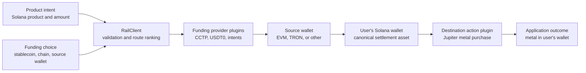

# Hedgents Stablecoin Rail

## Product vision, technical architecture, and MVP scope

**Status:** Alpha implementation  
**Last updated:** 2026-08-03  
**First application:** Hedgents metal terminal on Solana

---

## 1. Executive summary

Hedgents Stablecoin Rail is a non-custodial orchestration SDK that lets an application accept a supported stablecoin from another chain, settle the same stablecoin family on Solana, and continue into an application-specific action.

For Hedgents, that action is buying a metal product listed on Solana. The user chooses the product first, then chooses where to pay from. The experience should feel like:

> Choose a product on Solana. Pay with the stablecoin you already have, from any supported chain.

Examples include buying the same Solana gold product with USDC from Ethereum, USDC from Base, USDT from TRON, or another verified stablecoin route. Source chains supply capital; they do not define where the product is issued or held.

The implementation remains honest about what happens underneath:

1. The user signs a stablecoin transfer on the source chain.
2. An established interoperability protocol settles the stablecoin on Solana.
3. Hedgents verifies settlement and refreshes the product quote.
4. The user signs the Solana product purchase.

The rail is **not a new bridge**, does not run validators or solvers, and does not take custody. It is a common integration and UX layer over providers such as Circle CCTP, USDT0/LayerZero, and intent networks.

The metal terminal is the first reference application, but the rail is intentionally horizontal. Another Solana application should be able to use the same SDK to fund a lending deposit, checkout, vault, mint, subscription, or other destination action.

---

## 2. Product thesis

Cross-chain capital is fragmented by stablecoin, chain, wallet, bridge provider, signing format, status API, and failure behavior. Every Solana application that wants to attract capital from other chains must repeatedly solve the same problems:

- discover executable routes;
- keep provider credentials out of the browser;
- validate exact chain and token identities;
- construct source-wallet requests;
- track settlement and refunds;
- resume interrupted sessions;
- explain multiple signatures;
- refresh the destination action after funds arrive;
- preserve user custody when the destination action cannot execute.

Hedgents Stablecoin Rail turns those concerns into a reusable SDK and provider-plugin contract.

The product promise is:

> Use the stablecoin you already hold to fund a Solana application through one guided flow.

For Hedgents specifically:

> Trade products on Solana using stablecoin liquidity from everywhere Hedgents supports.

The product-selection direction is important:

```text
choose Solana product → choose stablecoin → choose source chain → fund → buy
```

The rail is not a catalog of products on every funding chain. Product inventory lives on Solana for the MVP; supported external chains are liquidity sources.

---

## 3. What makes this more than a bridge aggregator

A bridge aggregator typically ends when tokens arrive on a destination chain. The Hedgents rail is designed around the application outcome.

| Bridge aggregator | Hedgents Stablecoin Rail |
|---|---|
| Ranks bridge output | Ranks the guaranteed final application output |
| Ends at token delivery | Continues into a destination action |
| Exposes bridge-specific behavior | Normalizes providers behind one plugin contract |
| Often treats signing as a black box | Returns explicit unsigned wallet steps |
| Commonly hides partial completion | Models settlement, refund, recovery, and action failure separately |
| Optimizes a consumer bridge page | Provides reusable SDK primitives for other applications |

For a metal purchase, the best route is not necessarily the bridge with the lowest advertised fee. It is the route producing the best guaranteed metal output after funding costs, settlement minimums, and the refreshed Solana execution quote.

---

## 4. Product principles

### 4.1 Same stablecoin family in and out

The rail does not silently convert between stablecoins.

- USDC input should settle as canonical USDC.
- USDT input should settle as canonical USDT.
- USDG input should settle as canonical USDG when a verified route exists.

If a provider requires USDT → USDC or another stablecoin swap, that route is excluded from the default product. A future application may explicitly opt into conversion, but it must be presented as a swap rather than a bridge.

### 4.2 Exact asset identity

Symbols are display metadata, not security identifiers. Every enabled route pins:

- source chain;
- source token contract or mint;
- destination chain;
- destination token contract or mint;
- decimals;
- allowed bridge or forwarding targets;
- expected signer;
- minimum destination amount;
- quote expiry.

### 4.3 Existing transport providers

Hedgents does not create a new bridge, validator network, or wrapped stablecoin. Provider plugins integrate established transport paths.

### 4.4 User custody

Stablecoins settle into the user's destination wallet. If the metal trade fails or the market moves, the stablecoin remains controlled by the user on Solana.

### 4.5 Honest execution

The current product is two-phase:

1. fund Solana;
2. execute the Solana action.

The UI must not call this atomic. A future solver or onchain adapter may provide stronger composition, but only if its guarantees are explicit and independently verified.

### 4.6 Fail closed

An expired quote, changed signer, unexpected contract, unverified token, unsupported signature request, missing delivery evidence, or ambiguous output must stop execution.

### 4.7 Provider neutrality

Applications integrate the rail interface rather than a bridge-specific API. Providers can be added, compared, disabled, or replaced without rewriting the application flow.

---

## 5. User experience

The primary interface should ask for the user's intended outcome:

1. Choose a Solana product and amount.
2. See the best executable product route on Solana.
3. Choose the chain and stablecoin used to pay.
4. Connect the source wallet and Solana destination wallet.
5. Review minimum metal received, funding cost, ETA, and required signatures.
6. Sign the source funding transaction.
7. Follow settlement progress without losing the transaction on refresh.
8. Review the refreshed Solana product quote.
9. Sign the product purchase.

Provider names and route internals remain available as secondary disclosure. The primary action should say “Buy gold” or “Buy product,” not “Use bridge.”

### Recovery behavior

If funding completes but the metal action cannot execute:

- the user keeps the stablecoin on Solana;
- Hedgents offers a new metal quote;
- the user may choose another metal product;
- the user may leave with the stablecoin;
- Hedgents does not automatically trade at a worse price.

---

## 6. System architecture



### 6.1 Core SDK

`@hedgents/stablecoin-rail` provides:

- normalized funding intents;
- funding-provider and destination-action plugin contracts;
- complete-outcome quote ranking;
- quote and asset validation;
- unsigned EVM, Solana, and TRON wallet requests;
- normalized transaction references and statuses;
- an explicit resumable state machine.

### 6.2 React integration

`@hedgents/stablecoin-rail-react` exposes the core state machine through `useRailFlow`. It does not choose a wallet library or sign transactions.

### 6.3 Provider packages

Provider packages translate an upstream protocol into the normalized rail contract. Secrets and commercial API keys remain on the server.

The first dedicated provider package is:

`@hedgents/stablecoin-rail-layerzero`

It targets canonical TRON USDT → canonical Solana USDT through LayerZero's Value Transfer API and USDT0 Legacy Mesh.

### 6.4 Destination actions

A destination-action plugin owns:

- output product identity;
- destination quote;
- minimum output;
- Solana transaction construction;
- simulation policy;
- signature verification;
- final received-asset verification.

Jupiter metal execution is the first destination action.

### 6.5 Hosted control plane

The open-source SDK can call a project's own server. Hedgents may later provide a managed control plane for:

- provider credentials;
- route discovery and caching;
- contract and token allowlists;
- transaction decoding and simulation;
- status indexing and recovery;
- rate limiting and abuse protection;
- route analytics and observability;
- provider health and automatic disabling.

---

## 7. Flow state machine

The rail makes partial completion explicit:

```text
idle
  → quoting
  → quote-ready
  → preparing-funding
  → awaiting-source-signature
  → funding-pending
  → destination-ready
  → preparing-action
  → awaiting-destination-signature
  → action-pending
  → completed
```

Terminal alternatives are:

- `refunded` — the provider reports source funds returned;
- `failed` — funding or destination execution failed;
- `destination-ready` — funding succeeded but the user has not executed the action.

The selected quote and transaction references should be persisted outside temporary modal state so the user can resume after closing the browser.

---

## 8. Stablecoin and network coverage strategy

The rail separates two concerns:

- **Product inventory:** verified products that can be bought and held on Solana.
- **Funding liquidity:** stablecoins held by users on supported source chains.

Ethereum, Base, BNB Chain, TRON, Hyperliquid/HyperEVM, and Robinhood Chain are considered because they may hold useful stablecoin liquidity. They do not need to list the same product. The route's purpose is to bring purchasing power to the best executable Solana product.

The target checkout model is:

```text
Solana product
  ← canonical Solana settlement stablecoin
  ← established funding provider
  ← user's stablecoin on a supported source chain
```

### Route status definitions

- **Implemented:** production-shaped code and automated tests exist.
- **Integration scaffold:** the plugin boundary exists, but the upstream server adapter is not production-complete.
- **Planned:** route is part of the product strategy but not implemented.
- **Gated:** code exists but signing remains disabled pending an external requirement or mainnet verification.

| Stablecoin | Source | Destination | Provider | Status | Notes |
|---|---|---|---|---|---|
| USDC | Ethereum | Solana USDC | Circle CCTP V2 | Integration scaffold | Production server adapter and small-value mainnet proof remain required. |
| USDC | Base | Solana USDC | Circle CCTP V2 | Planned | Reuse the verified Ethereum CCTP boundary after the first route is proven. |
| USDC | HyperEVM | Solana USDC | Circle CCTP | Planned | HyperCore funding is a separate user step before HyperEVM CCTP when needed. |
| Binance-Peg USDC | BNB Chain | Solana USDC | Mayan | Integration scaffold | This is not native Circle CCTP and must be labeled as an adapter route. |
| USDT | TRON | Solana USDT | USDT0 / LayerZero | Implemented, gated | Quote and status adapter is tested; signing awaits official target allowlist, API credentials, and mainnet proof. |
| USDT | Ethereum | Solana USDT | Verified intent or USDT0 route | Planned | Must settle canonical USDT without a stablecoin swap. |
| USDT | BNB Chain | Solana USDT | Verified intent or USDT0 route | Planned | Enable only after exact source token and canonical output are verified. |
| USDG | Ethereum or Robinhood Chain | Verified Solana USDG | LayerZero OFT | Planned | Depends on a current canonical destination deployment and executable route verification. |

### Inventory and liquidity are independent

Hedgents does not need a metal product on Ethereum, Base, BNB Chain, TRON, Hyperliquid, or Robinhood Chain to support those networks as funding sources. A user may hold capital on one chain while the best product and execution venue are on Solana.

TRON is therefore one USDT liquidity source among several. Its metal inventory is irrelevant to the rail.

---

## 9. Current implementation status

### Completed

- Standalone npm workspace and package structure.
- Framework-neutral `RailClient`.
- Provider and destination-action plugin contracts.
- Quote validation and complete-outcome ranking.
- Explicit two-phase flow state machine.
- React state hook.
- EVM, Solana, and TRON unsigned wallet request types.
- Server-backed CCTP, Mayan, and Jupiter integration examples.
- Dedicated LayerZero TRON USDT → Solana USDT adapter.
- Canonical TRON and Solana USDT asset pins.
- LayerZero route filtering that rejects `SWAP` route steps.
- TRON signer and unsigned-envelope validation.
- Mandatory host policy hook for the current USDT0 target and recipient allowlist.
- Delivery, failure, unknown, and refund status normalization.
- Automated TypeScript, unit, and npm package checks.

### Not completed

- No package has been published to npm.
- The rail is not yet connected to the Hedgents terminal UI.
- No real wallet currently executes the returned TRON request in the terminal.
- No LayerZero production API key is configured.
- The official current USDT0 TRON target set has not been added.
- No TRON → Solana small-value mainnet transfer has been completed by Hedgents.
- Exact Solana destination balance-delta verification is not implemented for the LayerZero route.
- The Allbridge fallback is not implemented.
- Production CCTP and Mayan server adapters remain incomplete.
- Independent security review has not happened.

The project must therefore remain labeled **alpha** and **non-production**.

---

## 10. Provider implementation strategy

The rail is a common interface over several stablecoin families and transport providers. No single provider or source chain defines the product.

### 10.1 USDC routes

Native USDC routes should prefer Circle CCTP where both source and destination are supported. The first production target is Ethereum → Solana, followed by Base → Solana and other verified CCTP domains.

For every CCTP route, Hedgents must pin Circle domains and contracts, construct the source burn correctly, track attestation and mint completion, and verify canonical Solana USDC before offering the destination action.

BNB Chain is a different trust boundary because its commonly held USDC representation is not a native Circle CCTP source asset. That path must use a separately disclosed provider adapter and must never be labeled as native CCTP.

### 10.2 USDT routes

USDT routes should use established paths that deliver canonical Solana USDT without a hidden USDT → USDC conversion. Potential sources include TRON, Ethereum, and BNB Chain, but each route must independently pass asset, contract, minimum-output, refund, and mainnet verification.

USDT0/LayerZero is the first dedicated implementation because its current network exposes TRON and Solana USDT connectivity. It is an adapter implementation, not the scope of the stablecoin rail.

#### Current adapter case study: TRON → Solana USDT

##### Canonical asset pins

| Role | Identity |
|---|---|
| TRON wallet token | `TR7NHqjeKQxGTCi8q8ZY4pL8otSzgjLj6t` |
| LayerZero TRON token representation | `0xa614f803B6FD780986A42c78Ec9c7f77e6DeD13C` |
| Solana USDT mint | `Es9vMFrzaCERmJfrF4H2FYD4KCoNkY11McCe8BenwNYB` |

LayerZero discovery uses a 20-byte hexadecimal representation for the TRON token, while TRON wallets display the same contract using Base58Check. The adapter pins both forms.

##### Quote policy

The adapter accepts a quote only when:

- the exact source amount matches the intent;
- source and destination token identities are pinned;
- expected output is not below minimum output;
- the quote ID and expiry are valid;
- the route does not contain a stablecoin `SWAP` step.

##### Preparation policy

Before returning a wallet request, the adapter verifies:

- the step belongs to TRON;
- the required signer matches the connected source account;
- the transaction is unsigned;
- it contains `TriggerSmartContract` calls only;
- it does not unexpectedly transfer TRX or TRC-10 assets;
- a host-provided policy approves the current contract and recipient.

USDT0 advises direct smart-contract integrators to coordinate contract migrations. For this reason, the SDK does not permanently hardcode an unverified bridge recipient. Preparation fails until Hedgents configures an independently verified current allowlist.

##### Settlement policy

The adapter does not mark funding complete only because the upstream status says `SUCCEEDED`. It also requires a delivered Solana transaction in the execution history.

The current LayerZero status response does not prove the exact Solana balance delta, so `FundingStatus.received` remains empty. The destination action uses the funding quote's guaranteed minimum until Hedgents adds independent Solana receipt verification.

### 10.3 USDG routes

USDG is strategically relevant for Ethereum and Robinhood Chain liquidity. It should be enabled only after Hedgents verifies a canonical Solana settlement deployment, executable LayerZero/OFT path, wallet support, and sufficient destination liquidity for the selected product.

### 10.4 Provider comparison

Multiple providers may support the same stablecoin and source chain. The SDK should request them independently and rank the complete product outcome. It must not switch providers after the user signs unless the original provider has an explicit, safe recovery path.

---

## 11. Security model

### Trust boundaries

The user trusts:

- the selected stablecoin issuer;
- the source and destination chains;
- the chosen funding provider;
- the connected wallets;
- the destination DEX or action protocol;
- Hedgents' route validation and hosted control plane, when used.

The rail does not claim to remove the underlying provider's trust assumptions. It makes them explicit and replaceable.

### Required protections

1. Keep provider API keys server-side.
2. Pin chain, token, decimals, signer, spender, target, and recipient.
3. Decode every wallet request before signing.
4. Reject unexpected native value, unlimited approvals, or additional calls.
5. Use exact allowances where approvals are required.
6. Show the minimum destination amount and quote expiry.
7. Simulate destination transactions where feasible.
8. Treat transaction submission as pending, not complete.
9. Require destination-chain settlement evidence.
10. Persist recovery references.
11. Detect classic SPL Token versus Token-2022.
12. Independently verify the received destination asset and amount.

### TRON-specific protections

- Validate TronLink account and network.
- Estimate energy and bandwidth before signing.
- Show the possible TRX cost.
- Validate `fee_limit` and reject excessive values.
- Validate the transaction owner in both Base58Check and hexadecimal forms.
- Decode the TRC-20 call data and recipient.
- Require the current USDT0 contract/recipient allowlist.
- Confirm the TRON receipt succeeded before tracking cross-chain delivery.

### Solana-specific protections

- Pin the settlement mint and token program.
- Verify the destination associated token account owner.
- Track blockhash expiry and confirmation.
- Compare pre- and post-transaction token balances.
- Verify the destination transaction signature and output mint.
- Requote Jupiter after settlement rather than reusing a stale action quote.

---

## 12. Smart-contract strategy

No new Hedgents smart contract is required for the first stablecoin rail MVP.

The MVP should use:

- user-owned source accounts;
- existing bridge or interoperability contracts;
- user-owned Solana destination accounts;
- a separate user-signed destination action.

A Hedgents onchain program should be considered only when it creates a material capability that cannot be delivered safely offchain, such as:

- atomic destination execution guaranteed by a solver;
- user-controlled recovery escrow;
- recurring cross-chain funding authorization;
- programmable fee splitting;
- verifiable route receipts shared by multiple applications.

Deploying a contract merely to prove that Hedgents has onchain code would add risk without improving the product.

---

## 13. Business model

The recommended structure is open-source infrastructure plus a managed service.

### Open-source layer

- core SDK and interfaces;
- provider plugin specification;
- React state primitives;
- reference integrations;
- route validation helpers;
- transparent security model.

This encourages Solana applications to adopt the rail and makes Hedgents a distribution layer for capital entering Solana.

### Managed commercial layer

- hosted quote and transaction APIs;
- provider credential management;
- maintained contract and token allowlists;
- route health monitoring;
- transaction simulation and policy enforcement;
- status indexing and session recovery;
- analytics and enterprise support;
- service-level guarantees for production applications.

### Hedgents application revenue

The metal terminal can earn from the destination application outcome through clearly disclosed trading or service fees. The infrastructure SDK should not depend on hidden bridge markups.

Potential future revenue sources include:

- usage-based managed API pricing;
- enterprise integration and support plans;
- disclosed provider or destination-action revenue sharing;
- premium compliance, policy, or reporting modules;
- Hedgents metal execution fees.

---

## 14. Closed-beta scope

The closed beta should prove a universal Solana product checkout rather than a bridge-specific page:

> Choose a verified product on Solana, then pay with a supported stablecoin from a supported source chain.

The first beta does not need every planned route, but it should not launch as a single-chain demo. Minimum useful coverage is:

- at least one native USDC route, initially Ethereum or Base through CCTP;
- at least one additional source-chain adapter, initially BNB Chain or HyperEVM;
- at least one canonical USDT route, initially TRON, Ethereum, or BNB Chain;
- one shared Solana product that can be bought from all enabled funding routes;
- the same quote, recovery, and destination-action experience across providers.

### Required beta capabilities

- Choose the Solana product before choosing a funding route.
- Display supported stablecoins and source chains for that product.
- Connect the appropriate source wallet for EVM, TRON, or another enabled namespace.
- Connect a Solana wallet.
- Read the user's exact stablecoin balance on the selected source chain.
- Request live quotes from every eligible provider.
- Rank routes by guaranteed final product output.
- Display exact input, guaranteed Solana settlement minimum, fee estimate, ETA, and route provider.
- Run chain-specific gas, balance, approval, energy, or bandwidth checks.
- Decode and validate every wallet request against the route's current policy.
- Sign and broadcast from the user's source wallet.
- Persist the source transaction, provider, quote, and destination wallet references.
- Resume settlement tracking after refresh.
- Verify canonical Solana settlement and the exact stablecoin balance delta.
- Refresh the Jupiter product quote.
- Sign the Solana product purchase.
- Verify the product output.
- Provide a recovery path when the second action cannot execute.

### Beta exclusions

- Product discovery on funding chains; products are selected on Solana.
- Stablecoin-to-stablecoin conversion.
- Hedgents custody.
- Automatic trading without the second signature.
- Unsupported claims of atomicity.
- Large transfers before limits and recovery are tested.

### Beta success metrics

- Quote success rate by route.
- Wallet connection success rate.
- Source transaction signing completion.
- Funding settlement success and time.
- Session recovery success after refresh.
- Destination action completion.
- Difference between quoted minimum and actual received amount.
- Failure and refund resolution time.
- Percentage of users completing the full metal purchase.

---

## 15. Build sequence

### SR-0 — SDK foundation: completed

- Core plugin interfaces.
- Quote ranking and validation.
- Explicit flow state machine.
- React hook.
- Example CCTP, Mayan, and Jupiter boundaries.

### SR-1 — Provider adapter layer: in progress

Current state:

- Circle CCTP server-plugin scaffold for Ethereum USDC.
- Mayan server-plugin scaffold for BNB funding.
- Dedicated LayerZero TRON USDT adapter with canonical asset pins.
- Provider-independent quote and status interfaces.

No route is production-enabled yet.

### SR-2 — First production USDC routes

- Complete Ethereum → Solana CCTP quote, prepare, attestation, mint, and status handling.
- Run a small-value mainnet proof.
- Reuse the validated boundary for Base → Solana.
- Verify exact canonical Solana USDC balance deltas.

### SR-3 — Production USDT routes

- Obtain LayerZero credentials and the official current USDT0 TRON target/recipient set.
- Complete the TRON transaction policy and TronLink execution.
- Run a TRON USDT → Solana USDT mainnet proof.
- Evaluate Ethereum and BNB USDT routes under the same canonical-output policy.

### SR-4 — Additional source-chain adapters

- Complete the disclosed BNB funding adapter.
- Add HyperEVM CCTP where user demand justifies it.
- Add USDG from Ethereum or Robinhood Chain only after canonical Solana settlement is verified.

### SR-5 — Universal terminal checkout

- Choose the Solana product first.
- Discover compatible stablecoins and source chains.
- Connect the appropriate source wallet and Solana wallet.
- Rank complete product outcomes across providers.
- Render one funding, settlement, recovery, and destination-action flow.

### SR-6 — Mainnet route matrix

- Prove each enabled source/stablecoin pair with the smallest supported mainnet transfer.
- Record observed fees, latency, minimums, refunds, explorer links, and failure behavior.
- Verify the exact Solana stablecoin balance delta for every route.
- Add provider circuit breakers and transaction limits.

### SR-7 — Product purchase composition

- Connect settled USDC, USDT, or USDG to the selected Jupiter destination action.
- Refresh the product quote after funding.
- Simulate, sign, confirm, and verify the product purchase.
- Implement recovery when the product quote becomes unavailable.

### SR-8 — Redundancy and route expansion

- Add alternative providers as separate funding plugins.
- Quote fallbacks independently rather than switching invisibly after signing.
- Rank complete product output, not just delivered stablecoin.
- Expand coverage according to observed user balances and completed volume.

### SR-9 — Open-source release

- Independent security review.
- Public repository cleanup.
- npm scope ownership and trusted publishing.
- Alpha package release with provenance.
- Integration guide and runnable reference application.

---

## 16. Decisions recorded

| Date | Decision | Reason |
|---|---|---|
| 2026-08-03 | Build a provider-neutral stablecoin rail, not a new bridge | Existing protocols already solve transport; Hedgents should win on integration, policy, and UX. |
| 2026-08-03 | Select the Solana product before the funding route | The product is the user outcome; source chains are payment and liquidity choices. |
| 2026-08-03 | Treat external chains as liquidity sources rather than product inventory | A source chain does not need to list the product being bought on Solana. |
| 2026-08-03 | Keep stablecoin families unchanged by default | Silent stablecoin conversion changes issuer and liquidity risk. |
| 2026-08-03 | Settle into a user-owned Solana wallet before the destination action | Preserves recoverability and honest two-phase execution. |
| 2026-08-03 | Include TRON only as a USDT liquidity source | TRON's strategic value here is capital distribution into Solana, not metal inventory. |
| 2026-08-03 | Use USDT0/LayerZero as the primary TRON route | LayerZero's current transfer API exposes TRON and canonical Solana USDT connectivity. |
| 2026-08-03 | Keep Allbridge as a future fallback | Redundancy is useful, but fallback must be separately quoted and disclosed. |
| 2026-08-03 | Require a host transaction-policy hook for TRON | Current contract targets can migrate; blind signing or permanent unverified targets are unsafe. |
| 2026-08-03 | Do not deploy a Hedgents contract for the first MVP | It would add attack surface without improving the two-phase user-owned flow. |

---

## 17. Open questions

- Which source-chain and stablecoin combinations cover the largest share of likely beta users?
- Should the terminal request every eligible route or first filter by the user's detected balances?
- Which one or two Solana products have executable liquidity against both USDC and USDT?
- What should qualify a route for production: transfer count, maximum observed delay, refund test, and value limit?
- What are the official current TRON Legacy Mesh contract and recipient rules for third-party integrators?
- Does the LayerZero API return one or multiple TRON wallet steps for the production route?
- What TRX/energy budget is required for typical transfers?
- What is the provider's minimum transfer amount and timeout behavior?
- Can exact Solana delivery amounts be obtained from the provider, or should Hedgents always verify the token-account balance delta directly?
- Which Solana product has sufficient liquidity across the enabled settlement stablecoins?
- When should the managed control plane become a commercial service rather than a Hedgents-only backend?

---

## 18. Official references

- [LayerZero Value Transfer API](https://docs.layerzero.network/v2/developers/value-transfer-api/api-reference/overview)
- [LayerZero Value Transfer quickstart](https://docs.layerzero.network/v2/developers/value-transfer-api/quickstart)
- [USDT0 developer guide](https://docs.usdt0.to/technical-documentation/developer/)
- [USDT0 Legacy Mesh](https://blog.usdt0.to/introducing-the-legacy-mesh-your-usdt-anywhere-now-everywhere)
- [USDT0 Solana integration](https://blog.usdt0.to/solana-unlocks-interoperability-for-native-usdt-and-omnichain-tether-gold-liquidity)
- [TRON TRC-20 contract interaction](https://developers.tron.network/docs/trc20-contract-interaction)
- [Circle CCTP supported chains](https://developers.circle.com/cctp/concepts/supported-chains-and-domains)
- [Circle CCTP technical guide](https://developers.circle.com/cctp/references/technical-guide)
- [Mayan Quote API](https://docs.mayan.finance/integration/quote-api)
- [Mayan Forwarder contract](https://docs.mayan.finance/integration/forwarder-contract)
- [Paxos USDG deployments](https://docs.paxos.com/guides/stablecoin/usdg/mainnet)
